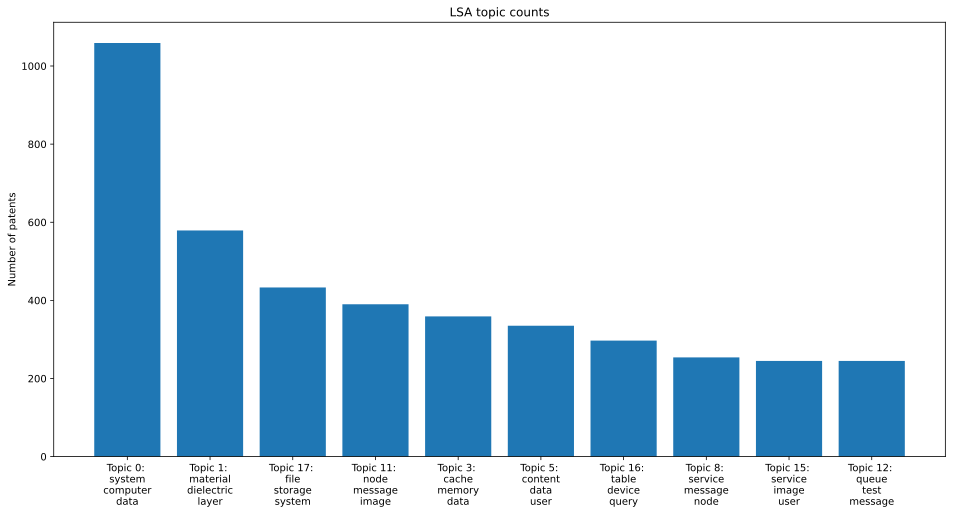

# Patents Text Analysis

Flexible, configurable code to perform web-scraping and text-mining on patents from Google Patents.

## Installation
```
git clone https://github.com/Maranc98/patents-nlp.git
cd ./patents-nlp
pip install -r requirements.txt
```

The web-scraping is performed using [Selenium](https://selenium-python.readthedocs.io/). You'll need to download the Chrome driver [here](https://sites.google.com/a/chromium.org/chromedriver/downloads).

Finally, configure the paths in [conf.py](./conf.py).


## Building the dataset 
Configure the application paths and the scraping parameters in [conf.py](./conf.py).
In particular, the scraping parameters are:
- Assignee's name
- Years range
- Language
- Number of result pages to scrape per year


Then run `build_dataset.py` to build the dataset.

```
~/patents-nlp$ python build_dataset.py
usage: build_dataset.py [-h] [--delete] [--all] [--scrape] [--download] [--convert] [--clean] [--overwrite] [--multiproc]

scrape, download, convert and clean the data

optional arguments:
  -h, --help   show this help message and exit
  --delete     delete all data
  --all        execute whole pipeline
  --scrape     scrape metadata
  --merge      merge the scraped metadata
  --download   download pdfs using metadata
  --convert    convert pdfs to txts
  --clean      clean txts
  --overwrite  overwrite existing files
  --multiproc  use multiprocessing
  --verbose    show INFO logging
```

The pipeline for building the dataset  is the following:

- Using the search criteria listed above, metadata of the patents is scraped from Google Patents, saving each year in its own `.csv` file.
- The metadata files are merged in a single `.csv` file.
- The patents listed in the unified `.csv` file are downloaded (as `.pdf` files).
- The `.pdf` files are converted to `.txt` by performing OCR with the [tika](https://github.com/chrismattmann/tika-python) python library.
- The `.txt` files are cleaned using the `nltk` python library: stop-words and punctuation removal, lemmification of tokens.

### Latent Semantic Analysis (LSA)

The code in [lsa_example.ipynb](./lsa_example.ipynb) shows how to perform a latent semantic analysis of the text corpus using the functions in the module `LSA`.

The code performs TFIDF on the text corpus, and then factorizes the words_documents matrix (using either SVD or NMF method), yielding the words- and documents- embedding of the latent topics.



The plot shows the top 10 topics found in text corpus (in this case, a sample from IBM's patents through the years 2000-2019). For each topic, the top 3 words are shown.

### Analyzing the trends of chosen topic
In the [topics_trends.ipynb](./topics_trends.ipynb) notebook, we perform an analysis of the trends of hand-made topics (sets of keywords) to study how their frequency changes through the years.

```
Medicine
 - Keywords: ['medical', 'patient', 'health', 'treatment']
ML
 - Keywords: ['neural', 'train', 'recognition', 'learn']
Aut. driving
 - Keywords: ['vehicle', 'autonomous', 'park']
Quantum comput.
 - Keywords: ['quantum']
```


## Authors

* **Alessandro Marincioni** - [Maranc98](https://github.com/Maranc98)
* **Federico Lusiani** - [FeLusiani](https://github.com/FeLusiani)